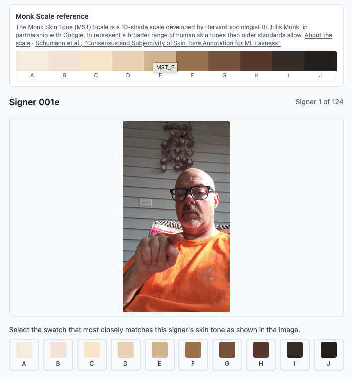

# Skin Tone Annotation Tool

A lightweight tool for manually assigning Monk Skin Tone (MST) Scale labels
to FSboard ASL fingerspelling signers, for use in fairness analysis. No
database — everything you rate lives in memory for the browser session.
Signer images are fetched on demand from FSboard's Kaggle dataset through a
small server-side proxy (see below) rather than requiring the full ~1TB
dataset to be downloaded.



## Background: the Monk Skin Tone Scale

The Monk Skin Tone (MST) Scale is a 10-shade scale developed by Harvard
sociologist Dr. Ellis Monk, in partnership with Google, to represent a
broader range of human skin tones than older standards (e.g. the Fitzpatrick
scale) allow — particularly for skin tones that were historically
underrepresented. See [skintone.google](https://skintone.google/) for
Google's overview, and Schumann et al.,
["Consensus and Subjectivity of Skin Tone Annotation for ML Fairness"](https://arxiv.org/abs/2305.09073)
(arXiv:2305.09073) for the methodology this tool's rating instructions are
based on.

## Labeling system

MST labels use **letters, not numbers**: `MST_A` (lightest) through `MST_J`
(darkest), matching the FSboard paper and Google's official MST
documentation.

## Setup

1. Get a Kaggle API token (Kaggle → Settings → API → "Create New Token") and
   make sure your account has accepted FSboard's dataset terms at
   [kaggle.com/datasets/googleai/fsboard](https://www.kaggle.com/datasets/googleai/fsboard).
2. Copy `.env.example` to `.env` and fill in `KAGGLE_API_TOKEN`.
3. Install and run:
   ```bash
   npm install
   npm run dev
   ```

Then open the URL Vite prints (usually `http://localhost:5173`).

`KAGGLE_API_TOKEN` is only ever read server-side (by `server/kaggleRoutes.js`)
— it's never bundled into the browser code.

## Loading data

1. **Signer images** — loaded automatically. On startup the app calls
   `/signers.json`, which lists every signer ID across FSboard's
   train/validation/test splits (124 signers total, no overlap between
   splits). Each signer's image is then fetched lazily, one at a time, from
   `/frames/<signerId>.jpg` as you navigate to them: in dev/production-server
   mode this downloads that signer's first video clip from Kaggle, extracts a
   single frame from its midpoint with `ffmpeg`, and caches the result in
   `.cache/frames/` so it's instant on subsequent loads (expect a few
   seconds' delay the first time you view a given signer). In a static
   export (see below) these are just pre-baked files, with no delay at all.
2. **ITA labels (optional)** — click "Load ita_labels.json" and select a
   JSON file mapping signer ID to an ITA-estimated MST label:

   ```json
   { "12345678": "MST_G", "87654321": "MST_C" }
   ```

   If you skip this step, the tool still works — the ITA reference and
   flagging are just hidden/disabled.

## Rating

- Click a swatch in the picker, or press keys **A–J** on your keyboard to
  assign `MST_A` through `MST_J` to the current signer.
- Use the **Back** / **Next** buttons (or Left/Right arrow keys) to move
  between signers and revise earlier ratings.
- Add optional free-text notes per signer.
- Signers where the human rating and ITA estimate diverge by **more than 2
  steps** on the A–J scale are automatically flagged and highlighted, both
  on the signer view and in the sidebar, so you can return to them.

## Exporting

Click **Export JSON** at any time (you don't need to finish the whole
batch first) to download `mst_annotations.json` in this format:

```json
[
  {
    "signer_id": "12345678",
    "monk_label": "MST_D",
    "ita_label": "MST_G",
    "flagged": true,
    "notes": ""
  }
]
```

## Sharing a static build with collaborators

If your collaborators don't have a Kaggle token or a dev environment set up,
you don't need either running server mode for them — you can bake every
signer's frame into plain static files once, then host the result anywhere
that serves static HTML (no Node, no Kaggle token, no `ffmpeg` required on
the server or by your collaborators):

```bash
npm run build:static
```

This runs `scripts/build-static-frames.js` (fetching/extracting any signer
frames not already cached, same as browsing normally would, just for all 124
up front) into `public/frames/*.jpg` and `public/signers.json`, then runs
`vite build` so they're bundled into `dist/` alongside the app. Upload the
contents of `dist/` to any static host (e.g. your `public_html/`) and share
the URL — collaborators just open it in a browser.

Note: the resulting URL is unauthenticated and reachable by anyone who has
it (no login prompt), same as any other file in `public_html/`. Re-run
`npm run build:static` and re-upload if FSboard's data changes or you want
to pick different representative clips/frames.

## Project structure

```
server/
  kaggleRoutes.js         shared route handlers: /signers.json and
                           /frames/<signerId>.jpg, backed by the Kaggle API
  kaggleProxy.js          Vite dev-server adapter (used by `npm run dev`)
  index.js                standalone production server + Basic Auth
                           (used by `npm start`, after `npm run build`)
scripts/
  build-static-frames.js  prefetches every signer's frame into public/, for
                           a fully static export (used by `npm run build:static`)
src/
  constants.js          MST label list, official hex colors, flag threshold
  utils/mst.js           flag calculation, JSON export
  components/
    MonkSwatch.jsx        the A-J reference color strip
    MonkPicker.jsx         the 10-swatch rating control
    SignerViewer.jsx       image + ITA reference + picker + notes + nav
    ProgressSidebar.jsx    per-signer list with ratings and flags
    ExportButton.jsx       serializes state to mst_annotations.json
  App.jsx                 top-level state and signer loading
```

`.cache/` (gitignored) holds downloaded metadata and extracted frame JPEGs
between runs. Delete it to force a fresh pull from Kaggle.

## Scope notes

- No database; annotation state lives in memory for the browser session
  (only the frame cache is persisted, on disk). Authentication is optional
  and only applies to the production server (`npm start`), via
  `BASIC_AUTH_USER`/`BASIC_AUTH_PASSWORD`.
- Static frames only, no video playback — one frame is extracted per signer
  from their first available clip.
- `vite preview` does not run the Kaggle proxy — use `npm run dev` locally or
  `npm start` (after `npm run build`) for a deployed instance.
- Single-rater only; no multi-rater reconciliation UI.
